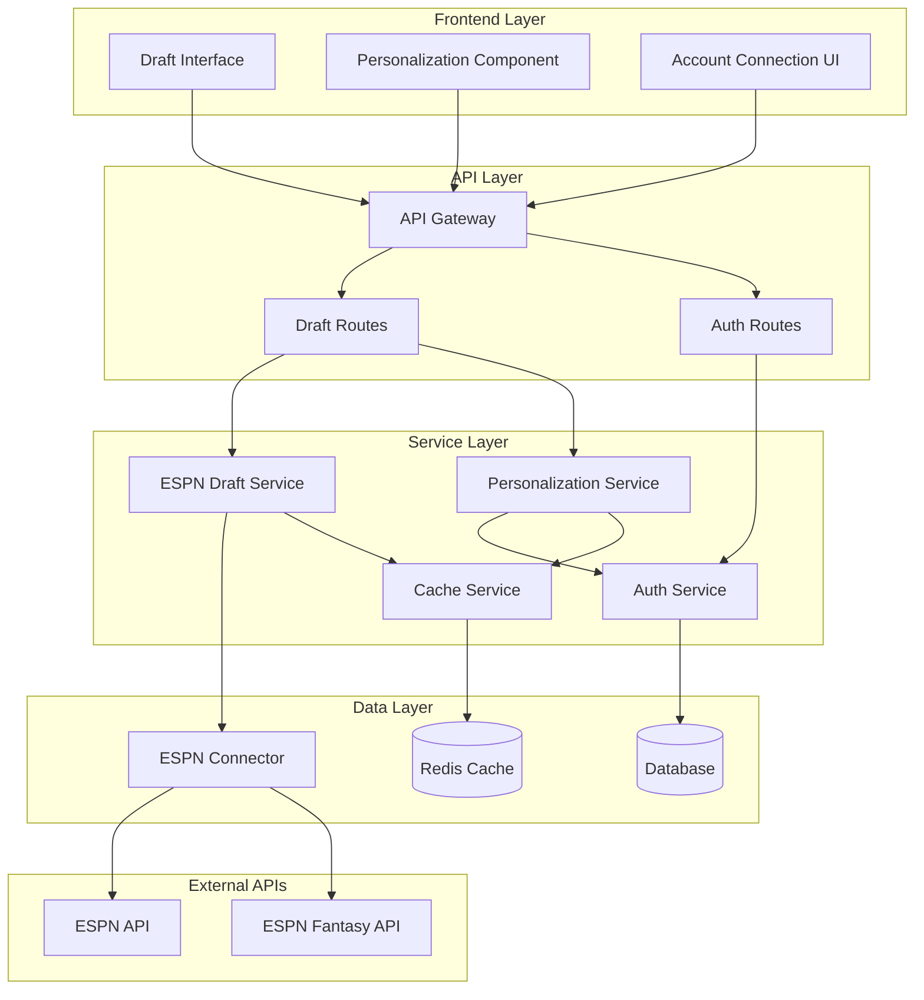

# ESPN Expert Draft Integration - Design Document

## Overview

The ESPN Expert Draft Integration feature extends the existing fantasy football platform by incorporating ESPN's expert draft analysis, mock draft data, and average draft positions (ADP) from their 2025 NFL rankings. The system provides both generic expert content for all users and personalized recommendations for users who have connected their ESPN fantasy accounts through OAuth integration.

This feature leverages the existing ESPN connector infrastructure while adding new endpoints and services specifically for fantasy draft content. The design emphasizes modularity, caching for performance, and secure user data handling.

## Architecture

### High-Level Architecture



### Component Interaction Flow

1. **Unauthenticated Users**: Access generic ESPN expert content through the ESPN Draft Service
2. **Authenticated Users**: Receive personalized content through the Personalization Service
3. **Account Connection**: OAuth flow through Auth Service to connect ESPN fantasy accounts
4. **Content Delivery**: Cached expert content with real-time personalization overlays

## Components and Interfaces

### 1. ESPN Draft Service

**Purpose**: Fetches and processes ESPN expert draft content

```typescript
interface ESPNDraftService {
  // Expert content retrieval
  getExpertRankings(position?: string): Promise<ExpertRanking[]>;
  getMockDraftResults(count?: number): Promise<MockDraftResult[]>;
  getAverageDraftPositions(leagueSize?: number): Promise<ADPData[]>;
  getExpertAnalysis(articleId?: string): Promise<ExpertAnalysis>;
  
  // Content updates
  refreshExpertContent(): Promise<void>;
  getContentLastUpdated(): Promise<Date>;
}

interface ExpertRanking {
  playerId: string;
  playerName: string;
  position: string;
  team: string;
  expertRank: number;
  tier: number;
  expertNotes: string;
  projectedPoints: number;
  riskLevel: 'LOW' | 'MEDIUM' | 'HIGH';
  lastUpdated: Date;
}

interface MockDraftResult {
  draftId: string;
  leagueSize: number;
  scoringFormat: string;
  picks: DraftPick[];
  expertAnalysis: string;
  draftDate: Date;
}

interface ADPData {
  playerId: string;
  playerName: string;
  position: string;
  averageDraftPosition: number;
  standardDeviation: number;
  draftPercentage: number;
  positionRank: number;
  leagueSize: number;
  scoringFormat: string;
}
```

### 2. Personalization Service

**Purpose**: Provides personalized draft recommendations based on connected ESPN accounts

```typescript
interface PersonalizationService {
  // User-specific content
  getPersonalizedRankings(userId: string, leagueId?: string): Promise<PersonalizedRanking[]>;
  getDraftRecommendations(userId: string, draftPosition: number): Promise<DraftRecommendation[]>;
  compareUserStrategy(userId: string, draftId: string): Promise<StrategyComparison>;
  
  // League-specific adjustments
  adjustForLeagueSettings(rankings: ExpertRanking[], leagueSettings: LeagueSettings): Promise<ExpertRanking[]>;
  getPositionalNeeds(userId: string, leagueId: string): Promise<PositionalNeed[]>;
}

interface PersonalizedRanking extends ExpertRanking {
  personalizedRank: number;
  leagueAdjustedRank: number;
  availabilityAtPosition: number;
  recommendationStrength: number;
  personalizedNotes: string;
}

interface DraftRecommendation {
  playerId: string;
  playerName: string;
  position: string;
  recommendationType: 'BEST_AVAILABLE' | 'POSITIONAL_NEED' | 'VALUE_PICK' | 'SLEEPER';
  confidence: number;
  reasoning: string;
  alternativeOptions: string[];
}

interface LeagueSettings {
  leagueId: string;
  leagueSize: number;
  scoringFormat: 'STANDARD' | 'PPR' | 'HALF_PPR' | 'SUPERFLEX';
  rosterPositions: RosterPosition[];
  draftType: 'SNAKE' | 'AUCTION' | 'LINEAR';
  customScoring: ScoringRule[];
}
```

### 3. ESPN Account Connection Service

**Purpose**: Manages OAuth integration with ESPN fantasy accounts

```typescript
interface ESPNAccountService {
  // OAuth flow
  initiateConnection(userId: string): Promise<OAuthUrl>;
  handleCallback(userId: string, authCode: string): Promise<ConnectionResult>;
  refreshConnection(userId: string): Promise<void>;
  disconnectAccount(userId: string): Promise<void>;
  
  // Account data
  getConnectedLeagues(userId: string): Promise<ESPNLeague[]>;
  getUserDraftHistory(userId: string): Promise<DraftHistory[]>;
  syncLeagueData(userId: string, leagueId: string): Promise<void>;
}

interface ConnectionResult {
  success: boolean;
  accessToken: string;
  refreshToken: string;
  expiresAt: Date;
  connectedLeagues: ESPNLeague[];
  userProfile: ESPNUserProfile;
}

interface ESPNUserProfile {
  espnId: string;
  displayName: string;
  email: string;
  profileImage: string;
  memberSince: Date;
}
```

### 4. Draft Content Cache Service

**Purpose**: Manages caching of expert content and personalized data

```typescript
interface DraftCacheService {
  // Expert content caching
  cacheExpertRankings(rankings: ExpertRanking[], ttl?: number): Promise<void>;
  getCachedExpertRankings(): Promise<ExpertRanking[] | null>;
  
  // Personalized content caching
  cachePersonalizedData(userId: string, data: any, ttl?: number): Promise<void>;
  getCachedPersonalizedData(userId: string): Promise<any | null>;
  
  // Cache management
  invalidateUserCache(userId: string): Promise<void>;
  invalidateExpertCache(): Promise<void>;
  getCacheStats(): Promise<CacheStats>;
}
```

## Data Models

### Database Schema Extensions

```sql
-- ESPN Account Connections
CREATE TABLE espn_connections (
    id UUID PRIMARY KEY DEFAULT gen_random_uuid(),
    user_id UUID NOT NULL REFERENCES users(id) ON DELETE CASCADE,
    espn_user_id VARCHAR(255) NOT NULL,
    access_token TEXT NOT NULL,
    refresh_token TEXT NOT NULL,
    expires_at TIMESTAMP NOT NULL,
    display_name VARCHAR(255),
    email VARCHAR(255),
    profile_image_url TEXT,
    connected_at TIMESTAMP DEFAULT NOW(),
    last_sync_at TIMESTAMP,
    is_active BOOLEAN DEFAULT true,
    UNIQUE(user_id),
    UNIQUE(espn_user_id)
);

-- ESPN League Connections
CREATE TABLE espn_leagues (
    id UUID PRIMARY KEY DEFAULT gen_random_uuid(),
    connection_id UUID NOT NULL REFERENCES espn_connections(id) ON DELETE CASCADE,
    espn_league_id VARCHAR(255) NOT NULL,
    league_name VARCHAR(255) NOT NULL,
    league_size INTEGER NOT NULL,
    scoring_format VARCHAR(50) NOT NULL,
    draft_type VARCHAR(50),
    season_year INTEGER NOT NULL,
    is_active BOOLEAN DEFAULT true,
    last_sync_at TIMESTAMP,
    UNIQUE(connection_id, espn_league_id)
);

-- Draft History
CREATE TABLE draft_history (
    id UUID PRIMARY KEY DEFAULT gen_random_uuid(),
    user_id UUID NOT NULL REFERENCES users(id) ON DELETE CASCADE,
    league_id UUID REFERENCES espn_leagues(id),
    draft_date DATE NOT NULL,
    draft_position INTEGER,
    total_picks INTEGER,
    draft_grade VARCHAR(10),
    picks JSONB NOT NULL,
    expert_comparison JSONB,
    created_at TIMESTAMP DEFAULT NOW()
);

-- Expert Content Cache
CREATE TABLE expert_content_cache (
    id UUID PRIMARY KEY DEFAULT gen_random_uuid(),
    content_type VARCHAR(100) NOT NULL,
    content_key VARCHAR(255) NOT NULL,
    content_data JSONB NOT NULL,
    expires_at TIMESTAMP NOT NULL,
    created_at TIMESTAMP DEFAULT NOW(),
    UNIQUE(content_type, content_key)
);
```

### TypeScript Models

```typescript
// Core draft models
interface DraftPick {
  pickNumber: number;
  round: number;
  playerId: string;
  playerName: string;
  position: string;
  team: string;
  adp: number;
  expertRank: number;
  actualPick: number;
  valueScore: number;
}

interface ExpertAnalysis {
  articleId: string;
  title: string;
  author: string;
  publishDate: Date;
  content: string;
  keyInsights: string[];
  playerSpotlights: PlayerSpotlight[];
  draftStrategy: DraftStrategy;
}

interface PlayerSpotlight {
  playerId: string;
  playerName: string;
  position: string;
  analysis: string;
  projectedRound: number;
  riskFactors: string[];
  upside: string;
}

interface DraftStrategy {
  earlyRoundStrategy: string;
  middleRoundTargets: string[];
  lateRoundSleepers: string[];
  positionPriority: string[];
  avoidList: string[];
}
```

## Error Handling

### Error Types and Responses

```typescript
enum DraftServiceError {
  ESPN_API_UNAVAILABLE = 'ESPN_API_UNAVAILABLE',
  INVALID_LEAGUE_SETTINGS = 'INVALID_LEAGUE_SETTINGS',
  CONNECTION_EXPIRED = 'CONNECTION_EXPIRED',
  INSUFFICIENT_PERMISSIONS = 'INSUFFICIENT_PERMISSIONS',
  CONTENT_NOT_FOUND = 'CONTENT_NOT_FOUND',
  RATE_LIMIT_EXCEEDED = 'RATE_LIMIT_EXCEEDED'
}

interface ErrorResponse {
  error: DraftServiceError;
  message: string;
  details?: any;
  retryAfter?: number;
  fallbackAvailable: boolean;
}
```

### Fallback Strategies

1. **ESPN API Unavailable**: Serve cached expert content with staleness indicators
2. **Connection Expired**: Prompt user to reconnect with graceful degradation to generic content
3. **Rate Limits**: Implement exponential backoff with cached content serving
4. **Partial Data**: Merge available data with clear indicators of missing information

## Testing Strategy

### Unit Testing

- **ESPN Draft Service**: Mock ESPN API responses, test data transformation
- **Personalization Service**: Test ranking adjustments and recommendation logic
- **Account Connection**: Mock OAuth flows, test token management
- **Cache Service**: Test TTL behavior, cache invalidation, and performance

### Integration Testing

- **End-to-End OAuth Flow**: Test complete ESPN account connection process
- **Data Synchronization**: Test league data sync and draft history import
- **Personalization Pipeline**: Test expert content + user data = personalized recommendations
- **Cache Performance**: Test cache hit rates and response times under load

### Performance Testing

- **Content Loading**: Measure expert content fetch and cache performance
- **Personalization Speed**: Test recommendation generation times
- **Concurrent Users**: Test system behavior with multiple simultaneous connections
- **Cache Efficiency**: Monitor cache hit rates and memory usage

## Security Considerations

### Data Protection

1. **OAuth Tokens**: Encrypted storage, automatic rotation, secure transmission
2. **User Data**: Minimal data collection, explicit consent, data retention policies
3. **API Keys**: Secure configuration management, rate limiting, monitoring
4. **Cache Security**: Encrypted cache entries for sensitive personalized data

### Privacy Compliance

1. **Data Minimization**: Only collect necessary ESPN account data
2. **User Control**: Easy account disconnection, data deletion options
3. **Transparency**: Clear privacy policy, data usage explanations
4. **Audit Trail**: Log all data access and modifications

### Access Control

1. **User Authentication**: Verify user identity before personalized content
2. **Permission Scoping**: Request minimal ESPN API permissions
3. **Session Management**: Secure session handling, automatic timeouts
4. **API Security**: Rate limiting, request validation, CORS policies

## Performance Optimization

### Caching Strategy

1. **Expert Content**: 6-hour TTL for rankings, 24-hour TTL for analysis articles
2. **Personalized Data**: 1-hour TTL for recommendations, 30-minute TTL for real-time draft assistance
3. **User Connections**: Cache connection status, refresh tokens proactively
4. **League Data**: Cache league settings, sync incrementally

### Content Delivery

1. **CDN Integration**: Serve static expert content through CDN
2. **Compression**: Gzip compression for API responses
3. **Pagination**: Paginate large datasets (mock drafts, historical data)
4. **Lazy Loading**: Load personalized content on-demand

### Database Optimization

1. **Indexing**: Index frequently queried fields (user_id, espn_league_id, content_type)
2. **Connection Pooling**: Optimize database connection management
3. **Query Optimization**: Use prepared statements, avoid N+1 queries
4. **Data Archival**: Archive old draft history, implement data retention policies

## Monitoring and Analytics

### Key Metrics

1. **Usage Metrics**: Expert content views, account connections, personalization requests
2. **Performance Metrics**: API response times, cache hit rates, error rates
3. **User Engagement**: Feature adoption, session duration, return usage
4. **System Health**: ESPN API availability, database performance, cache efficiency

### Alerting

1. **Service Availability**: ESPN API downtime, authentication service failures
2. **Performance Degradation**: Slow response times, high error rates
3. **Security Events**: Failed authentication attempts, suspicious API usage
4. **Data Quality**: Missing expert content, stale cache data

### Logging

1. **Request Logging**: All API requests with user context and timing
2. **Error Logging**: Detailed error information with stack traces
3. **Audit Logging**: User actions, data access, permission changes
4. **Performance Logging**: Query execution times, cache operations

## Deployment Considerations

### Environment Configuration

```yaml
# Environment variables
ESPN_API_BASE_URL: "https://site.api.espn.com/apis/site/v2"
ESPN_FANTASY_API_URL: "https://fantasy.espn.com/apis/v3"
ESPN_CLIENT_ID: "${ESPN_CLIENT_ID}"
ESPN_CLIENT_SECRET: "${ESPN_CLIENT_SECRET}"
ESPN_RATE_LIMIT: 200
DRAFT_CACHE_TTL: 3600
EXPERT_CONTENT_TTL: 21600
```

### Scaling Strategy

1. **Horizontal Scaling**: Stateless service design for easy scaling
2. **Load Balancing**: Distribute requests across multiple service instances
3. **Database Scaling**: Read replicas for expert content, write optimization for user data
4. **Cache Scaling**: Redis cluster for distributed caching

### Rollout Plan

1. **Phase 1**: Basic expert content integration (generic content only)
2. **Phase 2**: ESPN account connection and OAuth implementation
3. **Phase 3**: Personalized recommendations and draft assistance
4. **Phase 4**: Advanced features (historical analysis, mobile optimization)

## Future Enhancements

### Planned Features

1. **Real-time Draft Rooms**: Live draft assistance with expert recommendations
2. **Advanced Analytics**: Machine learning-enhanced personalization
3. **Social Features**: Share draft strategies, compare with friends
4. **Mobile App**: Native mobile experience for draft day

### Integration Opportunities

1. **Other Fantasy Platforms**: Yahoo, Sleeper, NFL.com integration
2. **Advanced Stats**: Integration with PFF, Football Outsiders
3. **News Integration**: Real-time injury reports, trade impacts
4. **Video Content**: Expert video analysis integration