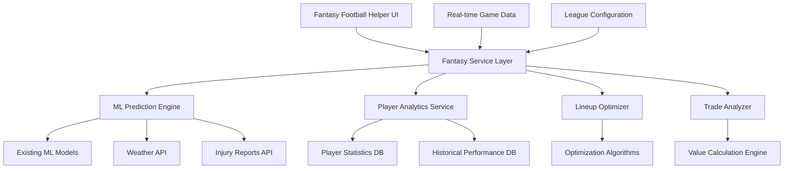

# Fantasy Football Helper - Design Document

## Overview

The Fantasy Football Helper is a comprehensive AI-powered assistant that integrates seamlessly with the existing Football Analytics Pro platform. It leverages the platform's ML models, player statistics, and predictive analytics to provide intelligent fantasy football management recommendations. The system uses advanced algorithms to optimize lineups, predict player performance, identify waiver wire targets, and analyze trades.

## Architecture

### High-Level Architecture



### Integration Points

The Fantasy Football Helper integrates with existing platform components:

- **ML Model Service**: Leverages existing XGBoost, Neural Network, and Ensemble models
- **Player Repository**: Uses existing player statistics and performance data
- **Weather API Connector**: Incorporates weather impact on player performance
- **Database Service**: Stores fantasy-specific data alongside existing analytics data

## Components and Interfaces

### 1. Fantasy Service Layer

**Purpose**: Central orchestration layer for all fantasy football operations

**Key Methods**:
```typescript
interface FantasyService {
  getLineupRecommendations(userId: string, week: number): Promise<LineupRecommendation[]>
  getPlayerProjections(playerId: string, week: number): Promise<PlayerProjection>
  getWaiverWireTargets(userId: string): Promise<WaiverTarget[]>
  analyzeTradeProposal(trade: TradeProposal): Promise<TradeAnalysis>
  getWeeklyStrategy(userId: string, week: number): Promise<WeeklyStrategy>
}
```

### 2. ML Prediction Engine

**Purpose**: Generates fantasy-specific predictions using existing ML infrastructure

**Key Features**:
- Adapts existing player performance models for fantasy scoring
- Incorporates matchup difficulty ratings
- Factors in weather conditions and injury probabilities
- Provides confidence intervals for all predictions

**Integration**:
```typescript
interface FantasyMLEngine {
  predictFantasyPoints(player: Player, matchup: Matchup, weather: Weather): Promise<FantasyPrediction>
  calculateMatchupDifficulty(player: Player, opponent: Team): Promise<MatchupRating>
  assessInjuryRisk(player: Player): Promise<InjuryRisk>
  generateProjectionRange(player: Player, week: number): Promise<ProjectionRange>
}
```

### 3. Lineup Optimizer

**Purpose**: Optimizes fantasy lineups using mathematical optimization algorithms

**Algorithm**: Mixed Integer Linear Programming (MILP) with constraints:
- Salary cap constraints (for DFS)
- Position requirements
- Player availability
- Correlation considerations (stacking strategies)

**Key Methods**:
```typescript
interface LineupOptimizer {
  optimizeLineup(players: Player[], constraints: LineupConstraints): Promise<OptimalLineup>
  generateMultipleLineups(players: Player[], count: number): Promise<OptimalLineup[]>
  calculateLineupProjection(lineup: Lineup): Promise<LineupProjection>
  validateLineup(lineup: Lineup, rules: LeagueRules): Promise<ValidationResult>
}
```

### 4. Player Analytics Service

**Purpose**: Provides detailed player analysis and comparisons

**Features**:
- Historical performance trends
- Matchup-based performance analysis
- Target share and usage rate tracking
- Red zone and goal line opportunity analysis

### 5. Trade Analyzer

**Purpose**: Evaluates trade proposals and identifies trade opportunities

**Valuation Model**:
- Rest-of-season projections
- Positional scarcity adjustments
- Schedule strength considerations
- Playoff schedule analysis

### 6. Waiver Wire Intelligence

**Purpose**: Identifies valuable waiver wire pickups and drop candidates

**Scoring Algorithm**:
- Opportunity score (target share, snap count trends)
- Matchup favorability
- Injury replacement value
- Schedule strength

## Data Models

### Fantasy User Profile
```typescript
interface FantasyUser {
  id: string
  leagueSettings: LeagueSettings
  currentRoster: Player[]
  rosterNeeds: PositionNeed[]
  tradingPreferences: TradingPreferences
  riskTolerance: RiskLevel
}
```

### League Settings
```typescript
interface LeagueSettings {
  scoringSystem: ScoringRules
  rosterPositions: RosterRequirements
  leagueSize: number
  tradeDeadline: Date
  playoffWeeks: number[]
  waiverSystem: WaiverType
}
```

### Player Projection
```typescript
interface PlayerProjection {
  playerId: string
  week: number
  projectedPoints: number
  confidenceInterval: [number, number]
  ceiling: number
  floor: number
  matchupRating: MatchupRating
  injuryRisk: InjuryRisk
  weatherImpact: WeatherImpact
}
```

### Lineup Recommendation
```typescript
interface LineupRecommendation {
  lineup: Lineup
  projectedPoints: number
  confidence: number
  reasoning: string[]
  alternatives: AlternativeOption[]
  riskLevel: RiskLevel
}
```

## Error Handling

### Graceful Degradation
- If ML models are unavailable, fall back to statistical averages
- If real-time data is delayed, use cached projections with staleness indicators
- If external APIs fail, provide recommendations based on historical data

### Error Recovery
- Implement circuit breakers for external API calls
- Cache critical data for offline operation
- Provide clear error messages with actionable suggestions

## Testing Strategy

### Unit Testing
- Test individual prediction algorithms
- Validate optimization constraints
- Test trade valuation calculations

### Integration Testing
- Test ML model integration
- Validate data pipeline accuracy
- Test real-time data processing

### Performance Testing
- Load test lineup optimization with large player pools
- Test real-time projection updates during game days
- Validate response times for mobile users

### User Acceptance Testing
- Test with actual fantasy football managers
- Validate recommendation accuracy against expert consensus
- Test user interface usability across devices

## Security Considerations

### Data Privacy
- Encrypt user roster and league information
- Implement user consent for data usage
- Provide data export and deletion capabilities

### API Security
- Rate limiting for optimization requests
- Authentication for premium features
- Input validation for all user data

## Performance Requirements

### Response Times
- Lineup optimization: < 3 seconds
- Player projections: < 1 second
- Trade analysis: < 2 seconds
- Waiver wire recommendations: < 2 seconds

### Scalability
- Support 10,000+ concurrent users during peak times
- Handle 1M+ projection requests per day
- Scale optimization algorithms for large player pools

## Monitoring and Analytics

### Key Metrics
- Prediction accuracy vs actual fantasy points
- User engagement with recommendations
- Lineup optimization success rates
- Trade analysis accuracy

### Alerting
- Model performance degradation
- API response time increases
- Data pipeline failures
- User error rate spikes