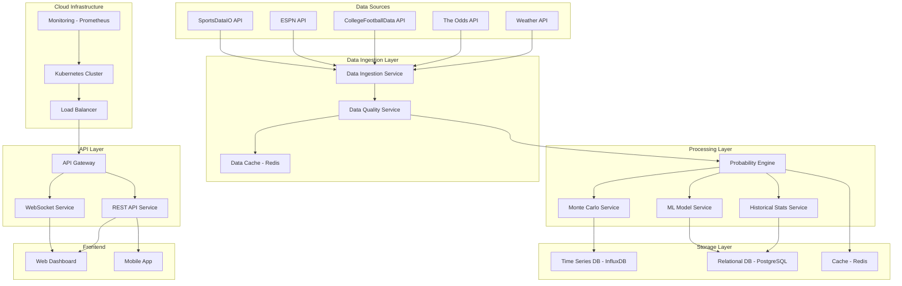

# Football Analytics System Design Document

## Overview

The Football Analytics System is a cloud-native, microservices-based platform that provides real-time predictive analytics for NFL and college football. The system integrates multiple data sources, employs advanced statistical modeling including Monte Carlo simulations and Bayesian inference, and delivers live probability updates through a responsive web interface.

The architecture follows event-driven patterns with horizontal scaling capabilities, ensuring high availability during peak game times while maintaining sub-5-second response times for critical predictions.

## Architecture

### High-Level Architecture



### Microservices Architecture

The system is decomposed into the following core services:

1. **Data Ingestion Service**: Orchestrates API calls, handles rate limiting, and manages data source failover
2. **Data Quality Service**: Validates, cleanses, and normalizes incoming data
3. **Probability Engine**: Core service that coordinates prediction calculations
4. **Monte Carlo Service**: Executes simulation workloads on cloud compute resources
5. **ML Model Service**: Manages training, inference, and model versioning
6. **Historical Stats Service**: Provides opponent-adjusted statistics and historical analysis
7. **WebSocket Service**: Manages real-time connections for live updates
8. **API Gateway**: Handles authentication, rate limiting, and request routing

## Components and Interfaces

### Data Ingestion Service

**Responsibilities:**
- Manage connections to external APIs with circuit breaker patterns
- Implement exponential backoff and retry logic
- Handle API rate limiting and quota management
- Coordinate data source failover strategies

**Key Interfaces:**
```typescript
interface DataIngestionService {
  fetchLiveScores(): Promise<GameScore[]>
  fetchOddsAndSpreads(): Promise<BettingLine[]>
  fetchPlayerProps(): Promise<PlayerProp[]>
  fetchInjuryReports(): Promise<InjuryReport[]>
  fetchWeatherData(venue: Venue): Promise<WeatherCondition>
}

interface APIConnector {
  connect(): Promise<void>
  isHealthy(): boolean
  getRateLimit(): RateLimitInfo
  executeRequest<T>(request: APIRequest): Promise<T>
}
```

### Probability Engine

**Responsibilities:**
- Coordinate Bayesian probability updates
- Manage game state and momentum tracking
- Trigger Monte Carlo simulations for complex scenarios
- Apply opponent-adjusted statistical models

**Key Interfaces:**
```typescript
interface ProbabilityEngine {
  initializeGameProbabilities(game: Game): Promise<GameProbabilities>
  updateProbabilities(event: GameEvent): Promise<GameProbabilities>
  calculateWinProbability(gameState: GameState): Promise<number>
  calculateSpreadProbability(spread: number, gameState: GameState): Promise<number>
}

interface BayesianUpdater {
  updatePrior(prior: Probability, evidence: Evidence): Probability
  calculatePosterior(likelihood: number, prior: number): number
}
```

### Monte Carlo Service

**Responsibilities:**
- Execute large-scale simulations on cloud infrastructure
- Manage compute resource scaling based on demand
- Provide confidence intervals and scenario analysis

**Key Interfaces:**
```typescript
interface MonteCarloService {
  runSimulation(scenario: SimulationScenario): Promise<SimulationResult>
  runBatchSimulations(scenarios: SimulationScenario[]): Promise<SimulationResult[]>
  scaleComputeResources(demand: ComputeDemand): Promise<void>
}

interface SimulationScenario {
  gameState: GameState
  iterations: number
  variables: SimulationVariable[]
  constraints: SimulationConstraint[]
}
```

### ML Model Service

**Responsibilities:**
- Manage multiple model types (XGBoost, Neural Networks, Ensemble)
- Handle model training, validation, and deployment
- Provide model explanations using SHAP values

**Key Interfaces:**
```typescript
interface MLModelService {
  trainModel(modelType: ModelType, trainingData: TrainingData): Promise<Model>
  predict(model: Model, features: FeatureVector): Promise<Prediction>
  explainPrediction(model: Model, features: FeatureVector): Promise<Explanation>
  validateModel(model: Model, testData: TestData): Promise<ValidationResult>
}

interface Model {
  id: string
  type: ModelType
  version: string
  accuracy: number
  lastTrained: Date
}
```

## Data Models

### Core Game Entities

```typescript
interface Game {
  id: string
  homeTeam: Team
  awayTeam: Team
  venue: Venue
  scheduledTime: Date
  status: GameStatus
  weather?: WeatherCondition
  officials: Official[]
}

interface Team {
  id: string
  name: string
  conference: string
  division?: string
  roster: Player[]
  coaching: CoachingStaff
  statistics: TeamStatistics
}

interface Player {
  id: string
  name: string
  position: Position
  injuryStatus: InjuryStatus
  statistics: PlayerStatistics
  props: PlayerProp[]
}

interface GameState {
  game: Game
  score: Score
  timeRemaining: TimeRemaining
  possession: Team
  fieldPosition: FieldPosition
  down: number
  yardsToGo: number
  momentum: MomentumIndicator
}
```

### Probability Models

```typescript
interface GameProbabilities {
  gameId: string
  timestamp: Date
  winProbability: {
    home: number
    away: number
  }
  spreadProbability: {
    spread: number
    probability: number
    confidence: number
  }
  totalProbability: {
    over: number
    under: number
    total: number
  }
  playerProps: PlayerPropProbability[]
}

interface SimulationResult {
  scenarioId: string
  iterations: number
  outcomes: OutcomeDistribution
  confidenceInterval: ConfidenceInterval
  keyFactors: Factor[]
  executionTime: number
}
```

### Historical Data Models

```typescript
interface OpponentAdjustedStats {
  teamId: string
  opponentId: string
  season: number
  offensiveEfficiency: number
  defensiveEfficiency: number
  situationalPerformance: SituationalStats
  coachingMatchup: CoachingMatchupStats
}

interface ProspectAnalysis {
  playerId: string
  college: string
  draftProjection: DraftProjection
  nflReadiness: ReadinessScore
  teamFitAnalysis: TeamFitScore[]
  comparablePlayerAnalysis: ComparablePlayer[]
}
```

## Error Handling

### Circuit Breaker Pattern

The system implements circuit breakers for all external API calls to prevent cascade failures:

```typescript
interface CircuitBreaker {
  state: CircuitState // CLOSED, OPEN, HALF_OPEN
  failureThreshold: number
  recoveryTimeout: number
  execute<T>(operation: () => Promise<T>): Promise<T>
}
```

### Graceful Degradation Strategy

1. **API Failures**: Fallback to cached data with staleness indicators
2. **Model Failures**: Use simpler backup models with reduced accuracy warnings
3. **Compute Overload**: Queue non-critical simulations and prioritize live game updates
4. **Database Issues**: Serve from Redis cache while maintaining write-ahead logging

### Data Quality Validation

```typescript
interface DataValidator {
  validateGameScore(score: GameScore): ValidationResult
  validateBettingLine(line: BettingLine): ValidationResult
  validatePlayerStat(stat: PlayerStatistic): ValidationResult
  detectAnomalies(data: any[]): Anomaly[]
}

interface ValidationResult {
  isValid: boolean
  errors: ValidationError[]
  warnings: ValidationWarning[]
  confidence: number
}
```

## Testing Strategy

### Unit Testing
- **Coverage Target**: 90% code coverage for core business logic
- **Frameworks**: Jest for TypeScript services, pytest for Python ML components
- **Mock Strategy**: Mock external APIs and databases for isolated testing

### Integration Testing
- **API Integration**: Test all external API integrations with contract testing
- **Database Integration**: Test data persistence and retrieval patterns
- **Service Communication**: Validate inter-service communication protocols

### Performance Testing
- **Load Testing**: Simulate peak game day traffic (10,000+ concurrent users)
- **Stress Testing**: Test system behavior under resource constraints
- **Monte Carlo Performance**: Validate simulation completion within SLA timeframes

### Model Validation
- **Backtesting**: Validate predictions against 3+ seasons of historical data
- **A/B Testing**: Compare model performance in production environments
- **Bias Detection**: Monitor for statistical bias in predictions across different teams/conferences

### End-to-End Testing
- **Game Simulation**: Automated testing using historical game data
- **Real-time Updates**: Validate WebSocket connections and live data flow
- **Failover Testing**: Test system behavior during API outages and service failures

### Monitoring and Observability
- **Metrics**: Track API response times, prediction accuracy, user engagement
- **Logging**: Structured logging with correlation IDs for distributed tracing
- **Alerting**: Automated alerts for system health, accuracy degradation, and performance issues
- **Dashboards**: Real-time operational dashboards for system monitoring