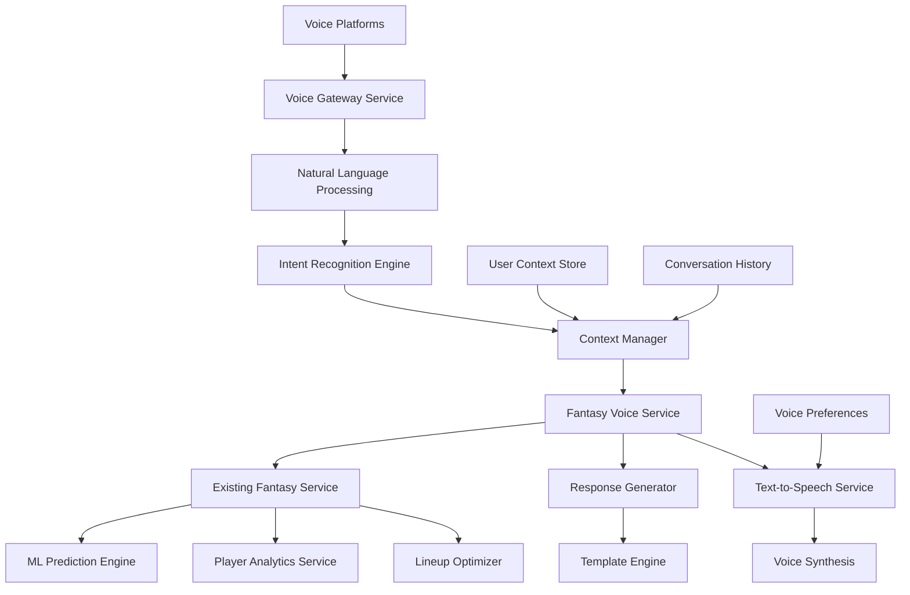

# Voice Assistant Integration - Design Document

## Overview

The Voice Assistant Integration extends the existing Fantasy Football Helper platform with natural language processing capabilities, enabling users to interact with their fantasy teams through voice commands across multiple platforms (Alexa, Google Assistant, Siri). The system leverages the existing fantasy analytics engine while adding conversational AI layers for intuitive voice interactions.

## Architecture

### High-Level Architecture



### Integration Points

The Voice Assistant integrates with existing platform components:

- **Fantasy Service**: Leverages all existing fantasy football functionality
- **ML Model Service**: Uses existing prediction models for voice responses
- **Database Service**: Stores voice interaction history and preferences
- **Authentication Service**: Handles voice-based user authentication

## Components and Interfaces

### 1. Voice Gateway Service

**Purpose**: Central entry point for all voice platform integrations

**Key Methods**:
```typescript
interface VoiceGatewayService {
  handleAlexaRequest(request: AlexaRequest): Promise<AlexaResponse>
  handleGoogleRequest(request: GoogleRequest): Promise<GoogleResponse>
  handleSiriRequest(request: SiriRequest): Promise<SiriResponse>
  authenticateVoiceUser(voiceUserId: string, platform: VoicePlatform): Promise<User>
}
```

**Platform Adapters**:
- Alexa Skills Kit integration
- Google Actions SDK integration  
- Siri Shortcuts integration
- Generic webhook support for future platforms

### 2. Natural Language Processing Engine

**Purpose**: Processes voice input and extracts intent and entities

**Key Features**:
- Intent classification (lineup, projections, waiver, trade analysis)
- Entity extraction (player names, positions, weeks, teams)
- Context-aware parsing
- Multi-turn conversation support

**Implementation**:
```typescript
interface NLPEngine {
  processVoiceInput(input: VoiceInput): Promise<ParsedIntent>
  extractEntities(text: string): Promise<EntityMap>
  classifyIntent(text: string, context: ConversationContext): Promise<Intent>
  resolveAmbiguity(entities: EntityMap, context: ConversationContext): Promise<ResolvedEntities>
}
```

### 3. Intent Recognition Engine

**Purpose**: Maps parsed intents to fantasy football actions

**Supported Intents**:
- `GetTeamStatus` - "How is my team doing?"
- `GetPlayerProjection` - "How many points will Josh Allen score?"
- `SetLineup` - "Start Derrick Henry at running back"
- `GetWaiverTargets` - "Who should I pick up this week?"
- `AnalyzeTrade` - "Should I trade CMC for Tyreek Hill?"
- `GetMatchupAnalysis` - "Tell me about this week's matchup"

**Intent Mapping**:
```typescript
interface IntentHandler {
  handleGetTeamStatus(context: UserContext): Promise<TeamStatusResponse>
  handleGetPlayerProjection(player: Player, week: number): Promise<ProjectionResponse>
  handleSetLineup(lineupChange: LineupChange): Promise<LineupResponse>
  handleGetWaiverTargets(week: number): Promise<WaiverResponse>
  handleAnalyzeTrade(trade: TradeProposal): Promise<TradeResponse>
}
```

### 4. Context Manager

**Purpose**: Maintains conversation state and user context across interactions

**Context Types**:
- User identity and league information
- Current conversation topic
- Previous questions and responses
- Pending actions requiring confirmation

**Implementation**:
```typescript
interface ContextManager {
  getConversationContext(sessionId: string): Promise<ConversationContext>
  updateContext(sessionId: string, update: ContextUpdate): Promise<void>
  resolvePlayerReference(playerRef: string, context: ConversationContext): Promise<Player>
  maintainConversationFlow(intent: Intent, context: ConversationContext): Promise<ConversationFlow>
}
```

### 5. Fantasy Voice Service

**Purpose**: Orchestrates fantasy operations for voice interactions

**Key Features**:
- Adapts existing fantasy service for voice responses
- Handles voice-specific business logic
- Manages multi-step voice workflows
- Provides conversational error handling

**Methods**:
```typescript
interface FantasyVoiceService {
  getVoiceTeamSummary(userId: string, week: number): Promise<VoiceTeamSummary>
  processVoiceLineupChange(change: VoiceLineupChange): Promise<VoiceLineupResult>
  getVoicePlayerAnalysis(playerId: string, week: number): Promise<VoicePlayerAnalysis>
  getVoiceWaiverRecommendations(userId: string): Promise<VoiceWaiverRecommendations>
  processVoiceTradeAnalysis(trade: VoiceTradeProposal): Promise<VoiceTradeAnalysis>
}
```

### 6. Response Generator

**Purpose**: Converts fantasy data into natural, conversational responses

**Response Types**:
- Informational responses (projections, analysis)
- Confirmation responses (lineup changes)
- Recommendation responses (waiver targets, trades)
- Error and clarification responses

**Template System**:
```typescript
interface ResponseGenerator {
  generateTeamSummary(data: TeamSummaryData): Promise<VoiceResponse>
  generatePlayerProjection(data: PlayerProjectionData): Promise<VoiceResponse>
  generateLineupConfirmation(data: LineupChangeData): Promise<VoiceResponse>
  generateWaiverRecommendations(data: WaiverData): Promise<VoiceResponse>
  generateErrorResponse(error: VoiceError): Promise<VoiceResponse>
}
```

### 7. Text-to-Speech Service

**Purpose**: Converts text responses to natural-sounding speech

**Features**:
- Platform-specific voice optimization
- SSML support for enhanced speech
- Voice personality customization
- Speed and tone adjustments

## Data Models

### Voice User Profile
```typescript
interface VoiceUserProfile {
  userId: string
  voicePlatforms: VoicePlatformConnection[]
  voicePreferences: VoicePreferences
  conversationHistory: ConversationSession[]
  quickAccessLeague: string
}
```

### Voice Platform Connection
```typescript
interface VoicePlatformConnection {
  platform: VoicePlatform
  platformUserId: string
  isLinked: boolean
  permissions: VoicePermission[]
  lastUsed: Date
}
```

### Conversation Context
```typescript
interface ConversationContext {
  sessionId: string
  userId: string
  currentLeague: string
  conversationTopic: ConversationTopic
  pendingActions: PendingAction[]
  entityContext: EntityContext
  lastInteraction: Date
}
```

### Voice Response
```typescript
interface VoiceResponse {
  text: string
  ssml?: string
  shouldEndSession: boolean
  reprompt?: string
  cardData?: CardData
  followUpSuggestions?: string[]
}
```

### Voice Intent
```typescript
interface VoiceIntent {
  name: string
  confidence: number
  entities: EntityMap
  requiresConfirmation: boolean
  multiStep: boolean
}
```

## Error Handling

### Voice-Specific Error Scenarios
- **Speech Recognition Failures**: "I didn't catch that, could you repeat?"
- **Ambiguous Player Names**: "I found multiple players named Johnson, did you mean Diontae Johnson or Calvin Johnson?"
- **Missing Context**: "Which league are you asking about?"
- **Invalid Actions**: "You can't start two quarterbacks, would you like me to suggest an alternative?"

### Graceful Degradation
- Fall back to simplified responses if complex data unavailable
- Offer alternative interaction methods when voice fails
- Maintain conversation context across error recovery

### Error Recovery Patterns
```typescript
interface VoiceErrorHandler {
  handleSpeechRecognitionError(error: SpeechError): Promise<VoiceResponse>
  handleAmbiguousEntity(entity: AmbiguousEntity): Promise<VoiceResponse>
  handleMissingContext(intent: Intent): Promise<VoiceResponse>
  handleServiceUnavailable(service: string): Promise<VoiceResponse>
}
```

## Testing Strategy

### Voice Interaction Testing
- **Intent Recognition Testing**: Validate intent classification accuracy
- **Entity Extraction Testing**: Test player name recognition and disambiguation
- **Conversation Flow Testing**: Verify multi-turn conversation handling
- **Platform Integration Testing**: Test across Alexa, Google, and Siri platforms

### Performance Testing
- **Response Time Testing**: Voice responses under 2 seconds
- **Concurrent User Testing**: Handle multiple simultaneous voice sessions
- **Platform Load Testing**: Test platform-specific performance limits

### User Experience Testing
- **Voice UI Testing**: Test with diverse accents and speech patterns
- **Conversation Natural Flow**: Ensure responses sound natural and helpful
- **Error Recovery Testing**: Test graceful handling of misunderstood commands

## Security Considerations

### Voice Authentication
- Voice print authentication for sensitive operations
- Account linking security for platform connections
- Session timeout and re-authentication

### Data Privacy
- Voice data encryption in transit and at rest
- Minimal voice data retention policies
- User consent for voice data processing
- GDPR and CCPA compliance for voice interactions

### Platform Security
- Secure webhook endpoints for voice platforms
- Request signature verification
- Rate limiting for voice requests

## Performance Requirements

### Response Times
- Intent recognition: < 500ms
- Fantasy data retrieval: < 1 second
- Complete voice response: < 2 seconds
- Multi-step conversation: < 3 seconds total

### Scalability
- Support 1,000+ concurrent voice sessions
- Handle 10,000+ voice requests per hour during peak times
- Scale across multiple voice platforms simultaneously

### Availability
- 99.9% uptime for voice services
- Graceful degradation when fantasy services unavailable
- Platform-specific failover mechanisms

## Platform-Specific Implementation

### Amazon Alexa Integration
```typescript
interface AlexaSkillHandler {
  LaunchRequestHandler: RequestHandler
  GetTeamStatusIntentHandler: RequestHandler
  SetLineupIntentHandler: RequestHandler
  GetPlayerProjectionIntentHandler: RequestHandler
  HelpIntentHandler: RequestHandler
  CancelAndStopIntentHandler: RequestHandler
}
```

### Google Assistant Integration
```typescript
interface GoogleActionHandler {
  welcome: ConversationHandler
  getTeamStatus: ConversationHandler
  setLineup: ConversationHandler
  getPlayerProjection: ConversationHandler
  fallback: ConversationHandler
}
```

### Siri Shortcuts Integration
```typescript
interface SiriShortcutHandler {
  getTeamStatusShortcut: ShortcutHandler
  setLineupShortcut: ShortcutHandler
  getProjectionsShortcut: ShortcutHandler
  getWaiverTargetsShortcut: ShortcutHandler
}
```

## Monitoring and Analytics

### Voice Interaction Metrics
- Intent recognition accuracy rates
- Entity extraction success rates
- Conversation completion rates
- User satisfaction scores
- Platform-specific usage patterns

### Performance Monitoring
- Voice response latency
- Platform API response times
- Error rates by intent type
- Session duration and engagement

### Business Metrics
- Voice user adoption rates
- Feature usage by voice vs web/mobile
- Voice-driven fantasy decisions
- User retention for voice users