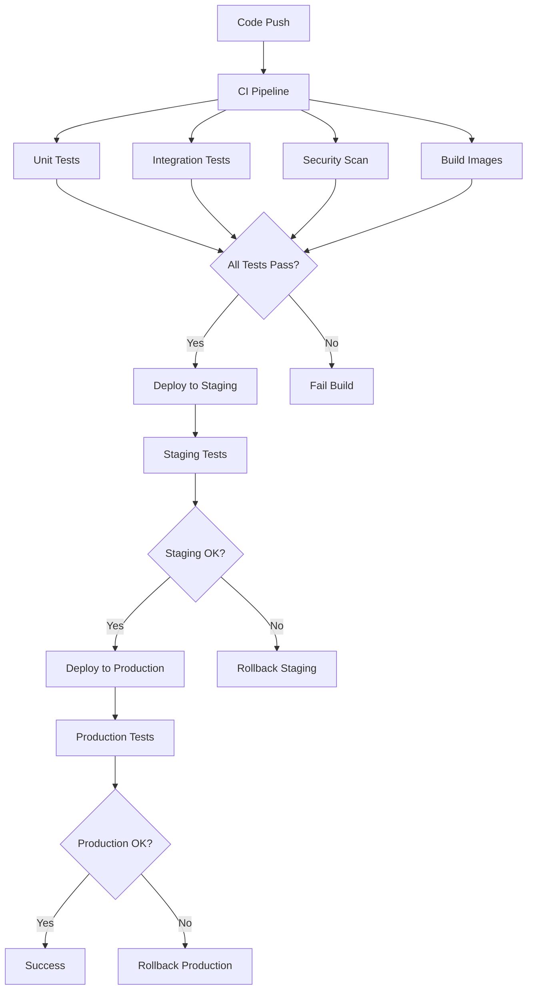

# CI/CD Pipeline Documentation

This document describes the Continuous Integration and Continuous Deployment pipeline for the Football Analytics System.

## Overview

The CI/CD pipeline is implemented using GitHub Actions and provides:

- **Continuous Integration**: Automated testing, security scanning, and code quality checks
- **Continuous Deployment**: Automated deployment to staging and production environments
- **Security**: Vulnerability scanning and dependency checks
- **Monitoring**: Deployment verification and rollback capabilities

## Pipeline Architecture



## Workflows

### 1. Continuous Integration (ci.yml)

**Triggers:**
- Push to `main` or `develop` branches
- Pull requests to `main` or `develop` branches

**Jobs:**

#### Test Job
- Sets up Node.js 18 environment
- Starts Redis, PostgreSQL, and InfluxDB services
- Runs linting and type checking
- Executes unit and integration tests
- Generates test coverage reports
- Uploads coverage to Codecov

#### Security Scan Job
- Runs npm audit for dependency vulnerabilities
- Executes Snyk security scanning
- Performs CodeQL static analysis
- Fails build on high-severity issues

#### Build Images Job
- Builds Docker images for all microservices
- Pushes images to GitHub Container Registry
- Uses Docker layer caching for efficiency
- Tags images with branch name and commit SHA

#### Performance Test Job
- Runs load tests on main branch pushes
- Validates system performance under load
- Uploads performance results as artifacts

### 2. Staging Deployment (cd-staging.yml)

**Triggers:**
- Push to `develop` branch
- Manual workflow dispatch

**Process:**
1. Configures AWS credentials and kubectl
2. Creates staging namespace
3. Deploys infrastructure services (Redis, PostgreSQL, InfluxDB)
4. Deploys application services
5. Configures staging-specific ingress
6. Runs deployment verification tests
7. Executes integration tests against staging
8. Sends Slack notifications

**Environment:** `staging`
- Namespace: `football-analytics-staging`
- Domains: `api-staging.football-analytics.com`, `ws-staging.football-analytics.com`

### 3. Production Deployment (cd-production.yml)

**Triggers:**
- Push to `main` branch
- Git tags matching `v*`
- Manual workflow dispatch

**Process:**
1. Runs pre-deployment tests (optional skip)
2. Creates backup of current deployment
3. Uploads backup to S3
4. Performs rolling updates in dependency order:
   - Infrastructure services
   - Core services (data-ingestion, probability-engine, etc.)
   - API services (api-gateway, websocket-service)
5. Verifies deployment health
6. Runs post-deployment and smoke tests
7. Updates deployment metadata
8. Cleans up old resources
9. Sends success notifications

**Rollback on Failure:**
- Automatic rollback if deployment fails
- Restores previous deployment state
- Verifies rollback success
- Sends failure notifications

**Environment:** `production`
- Namespace: `football-analytics`
- Domains: `api.football-analytics.com`, `ws.football-analytics.com`

## Security Features

### Dependency Scanning
- **npm audit**: Checks for known vulnerabilities in dependencies
- **Snyk**: Advanced vulnerability scanning with remediation suggestions
- **CodeQL**: Static code analysis for security issues

### Container Security
- Multi-stage Docker builds for minimal attack surface
- Non-root user execution
- Security updates in base images
- Minimal Alpine Linux base images

### Secrets Management
- GitHub Secrets for sensitive configuration
- Kubernetes Secrets for runtime credentials
- No secrets in code or logs
- Rotation procedures documented

## Testing Strategy

### Unit Tests
- **Coverage Target**: 90% for core business logic
- **Framework**: Jest with TypeScript support
- **Mocking**: External APIs and databases mocked
- **Execution**: Every push and PR

### Integration Tests
- **Scope**: Service-to-service communication
- **Environment**: Staging environment
- **Data**: Test data sets and scenarios
- **Validation**: End-to-end workflows

### Deployment Tests
- **Smoke Tests**: Basic functionality verification
- **Health Checks**: Service availability and readiness
- **Performance**: Response time validation
- **WebSocket**: Real-time connection testing

### Load Tests
- **Tool**: Jest with custom load testing utilities
- **Scenarios**: Peak game day traffic simulation
- **Metrics**: Response time, throughput, error rates
- **Thresholds**: Configurable performance criteria

## Monitoring and Observability

### Deployment Monitoring
- **Health Checks**: Kubernetes liveness and readiness probes
- **Metrics**: Prometheus metrics collection
- **Logging**: Structured logging with correlation IDs
- **Alerting**: Slack notifications for deployment events

### Performance Monitoring
- **Response Times**: API endpoint performance tracking
- **Resource Usage**: CPU and memory utilization
- **Error Rates**: Application and infrastructure errors
- **Business Metrics**: Prediction accuracy and user engagement

## Environment Configuration

### Development
```yaml
Environment: development
Replicas: 1 per service
Resources: Minimal (256Mi RAM, 250m CPU)
Monitoring: Basic health checks
Testing: Unit tests only
```

### Staging
```yaml
Environment: staging
Replicas: 2 per service
Resources: Production-like
Monitoring: Full monitoring stack
Testing: Integration and E2E tests
Data: Anonymized production data
```

### Production
```yaml
Environment: production
Replicas: 3-20 per service (auto-scaling)
Resources: Full allocation
Monitoring: Comprehensive monitoring
Testing: Smoke tests and health checks
Data: Live production data
```

## Rollback Procedures

### Automatic Rollback
- Triggered on deployment failure
- Uses Kubernetes rollout undo
- Validates rollback success
- Notifies team of rollback

### Manual Rollback
```bash
# Using rollback script
./scripts/rollback.sh rollback-all

# Using kubectl directly
kubectl rollout undo deployment/api-gateway -n football-analytics

# Restore from backup
./scripts/rollback.sh restore /path/to/backup.yaml
```

### Rollback Verification
- Health check validation
- Smoke test execution
- Performance verification
- User impact assessment

## Secrets and Configuration

### Required Secrets
```yaml
# AWS Configuration
AWS_ACCESS_KEY_ID: AWS access key for EKS
AWS_SECRET_ACCESS_KEY: AWS secret key
AWS_REGION: AWS region (e.g., us-west-2)
EKS_CLUSTER_NAME: Kubernetes cluster name

# Container Registry
GITHUB_TOKEN: GitHub token for container registry

# External Services
SNYK_TOKEN: Snyk security scanning token
SLACK_WEBHOOK: Slack webhook for notifications

# Backup
BACKUP_S3_BUCKET: S3 bucket for deployment backups

# Testing
TEST_API_KEY: API key for testing endpoints
```

### Configuration Management
- **ConfigMaps**: Non-sensitive configuration
- **Secrets**: Sensitive data (API keys, passwords)
- **Environment Variables**: Runtime configuration
- **Helm Charts**: Templated configurations (future enhancement)

## Best Practices

### Code Quality
- **Linting**: ESLint with TypeScript rules
- **Type Checking**: Strict TypeScript configuration
- **Testing**: Comprehensive test coverage
- **Code Review**: Required PR reviews

### Security
- **Dependency Updates**: Regular security updates
- **Vulnerability Scanning**: Automated security checks
- **Access Control**: Least privilege principles
- **Audit Logging**: Comprehensive audit trails

### Deployment
- **Blue-Green Deployments**: Zero-downtime deployments
- **Rolling Updates**: Gradual service updates
- **Health Checks**: Comprehensive health validation
- **Rollback Plans**: Automated rollback procedures

### Monitoring
- **Observability**: Comprehensive monitoring stack
- **Alerting**: Proactive issue detection
- **Logging**: Structured and searchable logs
- **Metrics**: Business and technical metrics

## Troubleshooting

### Common Issues

#### Build Failures
```bash
# Check workflow logs
gh run list --workflow=ci.yml
gh run view <run-id>

# Local testing
npm run test:unit
npm run lint
npm run type-check
```

#### Deployment Failures
```bash
# Check deployment status
kubectl get pods -n football-analytics
kubectl describe deployment api-gateway -n football-analytics

# Check logs
kubectl logs -f deployment/api-gateway -n football-analytics

# Manual rollback
./scripts/rollback.sh rollback-all
```

#### Test Failures
```bash
# Run tests locally
npm run test:integration
npm run test:smoke:production

# Check test environment
kubectl get services -n football-analytics-staging
```

### Debug Commands
```bash
# Check pipeline status
gh workflow list
gh run list --workflow=cd-production.yml

# Kubernetes debugging
kubectl get events -n football-analytics
kubectl top pods -n football-analytics

# Container debugging
docker logs <container-id>
kubectl exec -it <pod-name> -n football-analytics -- /bin/sh
```

## Maintenance

### Regular Tasks
- **Dependency Updates**: Weekly security updates
- **Image Updates**: Monthly base image updates
- **Secret Rotation**: Quarterly credential rotation
- **Performance Review**: Monthly performance analysis

### Upgrade Procedures
1. **Test in Development**: Validate changes locally
2. **Deploy to Staging**: Test in staging environment
3. **Performance Testing**: Validate performance impact
4. **Production Deployment**: Deploy during maintenance window
5. **Post-Deployment Validation**: Verify system health

### Disaster Recovery
- **Backup Strategy**: Daily automated backups
- **Recovery Procedures**: Documented recovery steps
- **RTO/RPO Targets**: 15 minutes RTO, 5 minutes RPO
- **Testing**: Monthly disaster recovery drills

## Support and Documentation

### Resources
- **Pipeline Logs**: GitHub Actions workflow logs
- **Monitoring**: Prometheus and Grafana dashboards
- **Documentation**: This document and inline comments
- **Support**: DevOps team and on-call procedures

### Contact Information
- **DevOps Team**: devops@football-analytics.com
- **On-Call**: PagerDuty integration
- **Slack**: #devops and #deployments channels
- **Documentation**: Internal wiki and GitHub README files